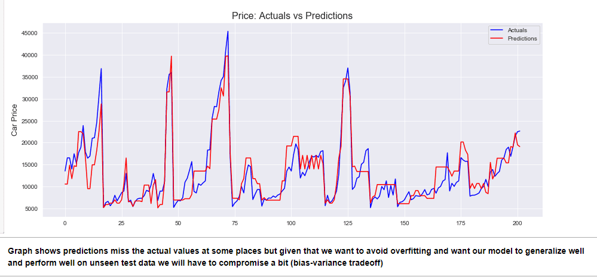
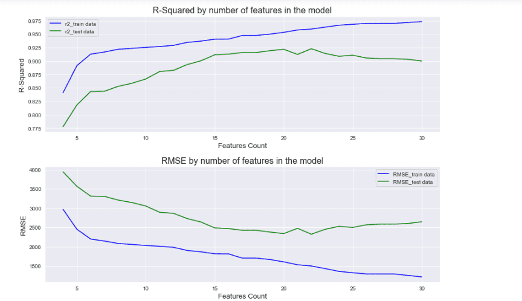
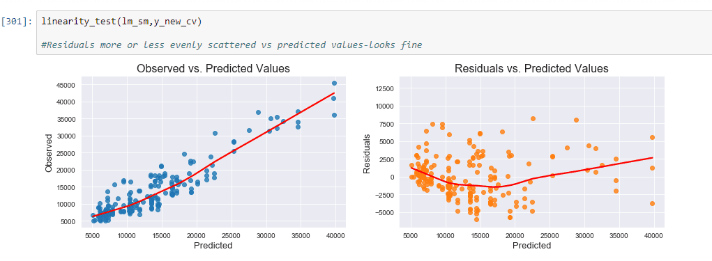
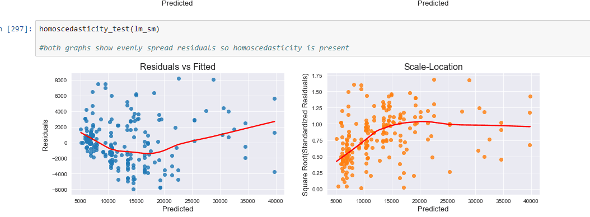
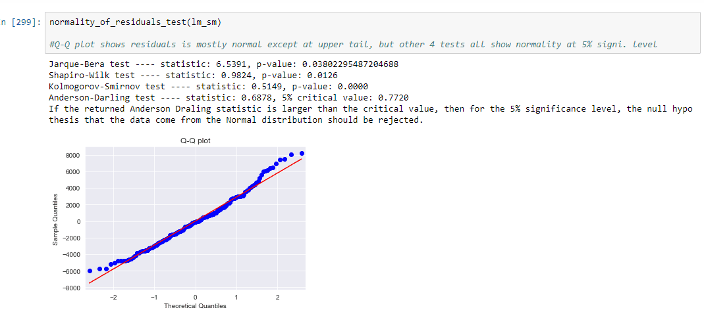
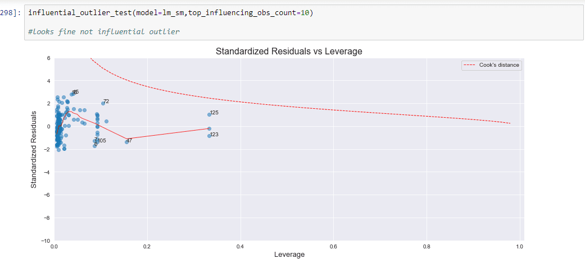

## Car-Price-Prediction-Highly-Comprehensive-Linear-Regression-Project-
A Linear Regression model to predict the car prices for the U.S market to help a new entrant understand important pricing factors/variables in the U.S automobile industry. A highly comprehensive analysis with all data cleaning, exploration, visualization, feature selection, model building, evaluation and MLR assumptions validity steps explained in detail.

## The jupyter notebook has following sections:

1- Data understanding and exploration 

2- Data cleaning

3- Data preparation: Feature Engineering and Scaling

4- Feature Selection using RFE and Model Building  

5- Linear Regression Assumptions Validation and Outlier Removal

6- Rebuilding the Model Post Outlier Removal: Feature Selection using K-Fold Cross Validation & RFE  

7- Removing Multicollinearity, Model Re-evaluation and Assumptions Validation

# Model Predictions vs Actual Values

# R-Squared & RMSE by number of features

Determining optimum number of features in model by checking performance metrics R-Squared and RMSE at different counts of features

# Linear Regression Assumptions Validation

Assumption_Presence of Linear Relationship: Holds as residuals more or less evenly scattered vs predicted values

#Assumption_Presence of Homoscedasticity: Both graphs show evenly spread residuals so homoscedasticity is present

Assumption_Normality of Residuals: Q-Q plot shows residuals is mostly normal except at upper tail, but other 4 tests all show normality at 5% signi. level

Assumption_Absence of Outliers: No point beyong cooks distance line so no outlier is present

